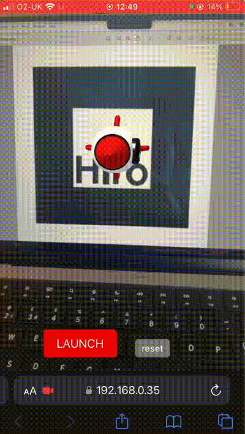

# ar-rocketship

Launch an AR rocket with less than 100 lines of code.

This is a basic example using [AR.js](https://ar-js-org.github.io/AR.js-Docs/) and [a-frame](https://aframe.io/), which renders a 3D rocket model, and animates it using a button.

The 3D model is triggered by the [Hiro marker](https://commons.wikimedia.org/wiki/File:Hiro_marker_ARjs.png) - the 3D model will be rendered where the camera recognises the marker.



## Run locally

You should run AR web apps using local https servers - this is done here by creating a self-signed certificate and running using node.js and http-server.

First install packages and create the certificates:

```bash
npm i
openssl req -nodes -new -x509 -keyout server.key -out server.cert
```

Run the server:

```bash
npm run start
```

Navigate to `127.0.0.1:8080` (or your local IPV4 address on your mobile) to access the app.

The main branch is deployed using github pages [HERE](https://joshmdrx.github.io/ar-rocketship/).
You can access it by scanning the QR code below and trigger the rocket with the marker as shown in the video above.


